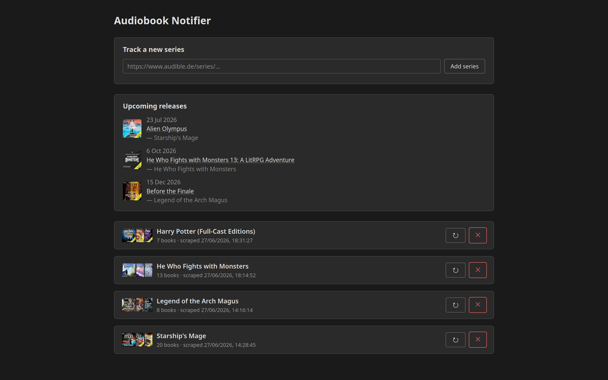

# Audiobook Notifier

A self-hosted web app that tracks Audible audiobook series and notifies you when new books are added or released. Paste an Audible series URL, and the app scrapes it periodically, stores the books in a local SQLite database, and sends [Matrix](https://matrix.org/) notifications on new discoveries and release days.



## Features

- Track any number of Audible series (audible.com and audible.de supported)
- Background scraping on a configurable interval (default: every 24 hours)
- Daily release-day notifications at 09:00
- Upcoming releases panel in the web UI
- Matrix notifications (optional) — with a setup wizard to create a bot room
- Light/dark mode web UI
- No external runtime dependencies beyond Python

## Installation

```bash
git clone <repo-url>
cd audiobook-notifier
pip install -r requirements.txt
cp .env.example .env
```

Edit `.env` to adjust settings (see [Configuration](#configuration) below), then start the server:

```bash
python -m audiobook_notifier
```

The web UI is available at `http://localhost:5000` by default.

## Configuration

All configuration is done via environment variables or a `.env` file in the project root.

| Variable | Default | Description |
|---|---|---|
| `DATABASE_PATH` | `./audiobook_notifier.db` | Path to the SQLite database file |
| `SCRAPE_INTERVAL_HOURS` | `24` | How often (in hours) to re-scrape all tracked series |
| `SCRAPE_DELAY_SECONDS` | `60` | Delay between scraping consecutive series (rate limiting) |
| `HOST` | `0.0.0.0` | Host for the Flask web server |
| `PORT` | `5000` | Port for the Flask web server |
| `LOG_LEVEL` | `INFO` | Python logging level (`DEBUG`, `INFO`, `WARNING`, `ERROR`) |
| `MATRIX_HOMESERVER` | _(empty)_ | Matrix homeserver URL — leave blank to disable notifications |
| `MATRIX_ACCESS_TOKEN` | _(empty)_ | Matrix bot access token |
| `MATRIX_ROOM_ID` | _(empty)_ | Room ID (`!abc:example.org`) or alias (`#name:example.org`) |

## Matrix Notifications

Matrix notifications are optional. All three `MATRIX_*` variables must be set to enable them.

The easiest way to set up a bot account and notification room is the built-in wizard:

```bash
python -m audiobook_notifier setup-matrix
```

The wizard logs in with a bot account, creates a private room, invites you, promotes your account to admin, and prints the three environment variables to add to your `.env` file.

For an existing bot account, set the variables manually:

```env
MATRIX_HOMESERVER=https://matrix.example.org
MATRIX_ACCESS_TOKEN=your_access_token_here
MATRIX_ROOM_ID=!yourRoomId:example.org
```

Two types of notifications are sent:
- **New book discovered** — when a scrape finds a book that wasn't in the database before
- **Releasing today** — sent at 09:00 on the day a tracked book is released
