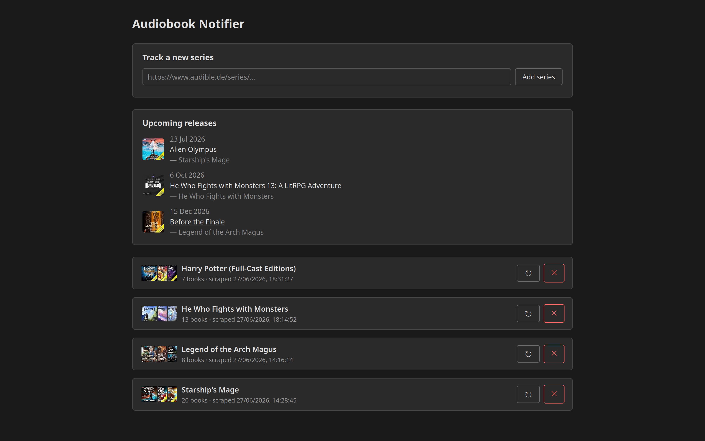

# Audiobook Notifier

A self-hosted web app that tracks Audible audiobook series and notifies you when new books are added or released. Paste an Audible series URL, and the app scrapes it periodically, stores the books in a local SQLite database, and sends [Matrix](https://matrix.org/) notifications on new discoveries and release days.



## Features

- Track any number of Audible series (audible.com and audible.de supported)
- Background scraping on a configurable interval (default: every 24 hours)
- Daily release-day notifications (09:00 local time by default, configurable)
- Upcoming releases panel in the web UI
- Matrix notifications (optional) — with a setup wizard to create a bot room
- Light/dark mode web UI
- No external runtime dependencies beyond Python

## Installation

```bash
git clone <repo-url>
cd audiobook-notifier
pip install -e .
cp .env.example .env
```

Edit `.env` to adjust settings (see [Configuration](#configuration) below), then start the server:

```bash
python -m audiobook_notifier
```

The web UI is available at `http://localhost:5000` by default.

## Configuration

All configuration is done via environment variables or a `.env` file in the project root.

`RELEASE_CHECK_HOUR`/`RELEASE_CHECK_MINUTE` are interpreted in the container's local timezone. Set the standard `TZ` environment variable (e.g. `TZ=Europe/Berlin`) to control what "local time" means; without it, the check runs in the container's default timezone (UTC).

| Variable                   | Default     | Description
|----------------------------|-------------|------------------
| `DATABASE_PATH`            | `data.db`   | Path to the SQLite database file
| `SCRAPE_INTERVAL_HOURS`    | `24`        | How often (in hours) to re-scrape all tracked series
| `SCRAPE_DELAY_SECONDS`     | `5`         | Delay between scraping consecutive series (rate limiting)
| `SCRAPE_TIMEOUT_SECONDS`   | `30`        | HTTP timeout for a single API request
| `SCRAPE_RETRY_ATTEMPTS`    | `6`         | How often to re-fetch a series before giving up — see [How scraping works](#how-scraping-works)
| `SCRAPE_RETRY_BACKOFF_SECONDS`     | `5`  | Initial delay between scrape attempts, doubling each time
| `SCRAPE_RETRY_MAX_BACKOFF_SECONDS` | `30` | Upper bound on that delay
| `RELEASE_CHECK_HOUR`       | `9`         | Hour (0-23, in the container's local time) to run the daily release check
| `RELEASE_CHECK_MINUTE`     | `0`         | Minute (0-59) to run the daily release check
| `HOST`                     | `127.0.0.1` | Host for the Flask web server
| `PORT`                     | `5000`      | Port for the Flask web server
| `LOG_LEVEL`                | `INFO`      | Python logging level (`DEBUG`, `INFO`, `WARNING`, `ERROR`)
| `MATRIX_HOMESERVER`        |             | Matrix homeserver URL — leave blank to disable notifications
| `MATRIX_ACCESS_TOKEN`      |             | Matrix bot access token
| `MATRIX_ROOM_ID`           |             | Room ID (`!abc:example.org`) or alias (`#name:example.org`)
| `NOTIFY_SCRAPE_ERRORS`     | `false`     | Set to `true` to also notify when a series scrape fails
| `MATRIX_MSGTYPE_NEW_BOOK`  | `m.notice`  | Matrix message type — `m.notice` is silent, `m.text` triggers push notifications
| `MATRIX_MSGTYPE_RELEASING_TODAY` | `m.notice` | As above, for release-day announcements
| `MATRIX_MSGTYPE_POSTPONED` | `m.notice`  | As above, for postponement announcements
| `MATRIX_MSGTYPE_SCRAPE_ERROR`    | `m.notice` | As above, for scrape failures
| `MATRIX_TIMEOUT_SECONDS`   | `10`        | HTTP timeout for a single Matrix request
| `MATRIX_RETRY_ATTEMPTS`    | `3`         | How often to retry a send that failed on a connection error, 5xx or 429
| `MATRIX_RETRY_BACKOFF_SECONDS`     | `2`  | Initial delay between send attempts, doubling each time
| `MATRIX_RETRY_MAX_BACKOFF_SECONDS` | `60` | Upper bound on that delay
| `SECRET_KEY`               |             | Secret key for signing session cookies — required when using any form of authentication; an ephemeral key is used if not set (sessions reset on restart)
| `AUTH_USERNAME`            |             | Username for local authentication — leave blank to disable
| `AUTH_PASSWORD`            |             | Password for local authentication
| `OIDC_CLIENT_ID`           |             | OIDC client ID — leave blank to disable OIDC login
| `OIDC_CLIENT_SECRET`       |             | OIDC client secret
| `OIDC_ISSUER_URL`          |             | OIDC provider base URL
| `OIDC_REDIRECT_URI`        |             | Override the OIDC callback URL
| `METRICS_BASIC_AUTH_USER`  |             | Username for Basic Auth on `/metrics` — leave blank to keep endpoint open
| `METRICS_BASIC_AUTH_PASS`  |             | Password for Basic Auth on `/metrics`

## Authentication

The app supports two optional authentication methods. If neither is configured, the UI is accessible without login.

### Local authentication

Set `AUTH_USERNAME` and `AUTH_PASSWORD` to enable a username/password login screen. If both are set, OIDC is ignored.

### OpenID Connect (OIDC)

Set `OIDC_CLIENT_ID`, `OIDC_CLIENT_SECRET`, and `OIDC_ISSUER_URL` to enable OIDC login. The provider's discovery document is fetched automatically from `{OIDC_ISSUER_URL}/.well-known/openid-configuration`. Examples:

```env
# Authentik
OIDC_ISSUER_URL=https://auth.example.com/application/o/myapp

# Keycloak
OIDC_ISSUER_URL=https://auth.example.com/realms/myrealm

# Google
OIDC_ISSUER_URL=https://accounts.google.com
```

Register `http(s)://your-host/auth/oidc/callback` as the redirect URI with your provider. If the app runs behind a reverse proxy, set `OIDC_REDIRECT_URI` to the public-facing callback URL explicitly.

### SECRET_KEY

Both authentication methods use Flask session cookies. Set `SECRET_KEY` to a stable random value so sessions survive restarts:

```bash
python -c "import secrets; print(secrets.token_hex(32))"
```

## Matrix Notifications

Matrix notifications are optional. All three `MATRIX_*` variables must be set to enable them.

The easiest way to set up a bot account and notification room is the built-in wizard:

```bash
python -m audiobook_notifier setup-matrix
```

The wizard logs in with a bot account, creates a private room, invites you, promotes your account to admin, and prints the three environment variables to add to your `.env` file.

For an existing bot account, set the variables manually:

```env
MATRIX_HOMESERVER=https://matrix.example.org
MATRIX_ACCESS_TOKEN=your_access_token_here
MATRIX_ROOM_ID=!yourRoomId:example.org
```

The notifications sent are:

- **New book discovered** — when a scrape finds a book that wasn't in the database before
- **Releasing today** — sent at `RELEASE_CHECK_HOUR` on the day a tracked book is released
- **Postponed** — when Audible moves a release we already announced to a later date. The book is then announced again on its real release date
- **Scrape failed** — only when `NOTIFY_SCRAPE_ERRORS=true`

## How scraping works

Series data comes from Audible's own catalog API — the unauthenticated one their
web frontend talks to — not from the HTML series page. Two requests per series:

1. `GET https://api.audible.de/1.0/catalog/products/{series_asin}?response_groups=relationships,product_desc`
   returns the series title and the ASIN of every volume.
2. `GET https://api.audible.de/1.0/catalog/products?asins=...` returns the full
   metadata for those ASINs, batched 50 at a time.

The series ASIN is the last path segment of the series URL you add, and the API
host follows that URL's marketplace — `www.audible.de` is served by
`api.audible.de`, `www.audible.com` by `api.audible.com`, and so on. Series and
product ASINs are minted per storefront, so the same series has a different ASIN
on each one and asking the wrong host returns an empty stub.

This replaced HTML scraping, which Audible broke by rolling out a
`<adbl-product-row>` web-component series page carrying no release dates at all.
The API is also simply better data: release dates arrive as ISO `YYYY-MM-DD`
rather than a localised string that had to be guessed at per marketplace.

Two things get filtered out along the way:

- **Placeholder products**, which Audible seeds for volumes it has announced but
  not dated. They carry a `PL_HLDR_` SKU, a 2200-01-01 release date, no cover and
  no runtime, and there is nothing a release notifier can do with them.
- **Nothing else.** The API lists every edition of a series, including
  re-recordings and alternate publishers that the old HTML page never showed. The
  first API scrape of a series therefore imports a batch of books that are new to
  the database but not news to you, so that first pass is silent — no new-book
  notifications until the series has been scraped through the API once.

A scrape retries the whole two-request sequence, with a capped exponential
backoff, and a series that exhausts its attempts is skipped entirely for that
run rather than written to the database — a failed fetch can never overwrite good
data. A partly-fetched batch counts as a failure for the same reason: half a
series is indistinguishable from a series that lost books.

## Production

Instead of using the internal web server, which is meant for debugging only, in production, you can run the app using a WSGI server like gunicorn, installed by the `server` extra:

```bash
pip install -e '.[server]'

gunicorn -w 1 --threads 4 --timeout 0 -b 127.0.0.1:5000 audiobook_notifier.__main__:app
```

`-w 1` is required: the scheduler starts on import, so every additional worker
would scrape and notify a second time.

`--timeout 0` matters just as much. Gunicorn's 30-second default is there to
kill a wedged request handler, but the scrape run lives in a background thread
inside that same worker and takes far longer, so the arbiter ends up SIGKILLing
a perfectly healthy worker in the middle of a run — losing it entirely and
resetting the interval timer.

A full run takes roughly `series × SCRAPE_DELAY_SECONDS`, plus up to ~95s for
each series that has to exhaust its retries. For 25 series that is around two
minutes normally, and up to about 40 minutes if every single series fails.
